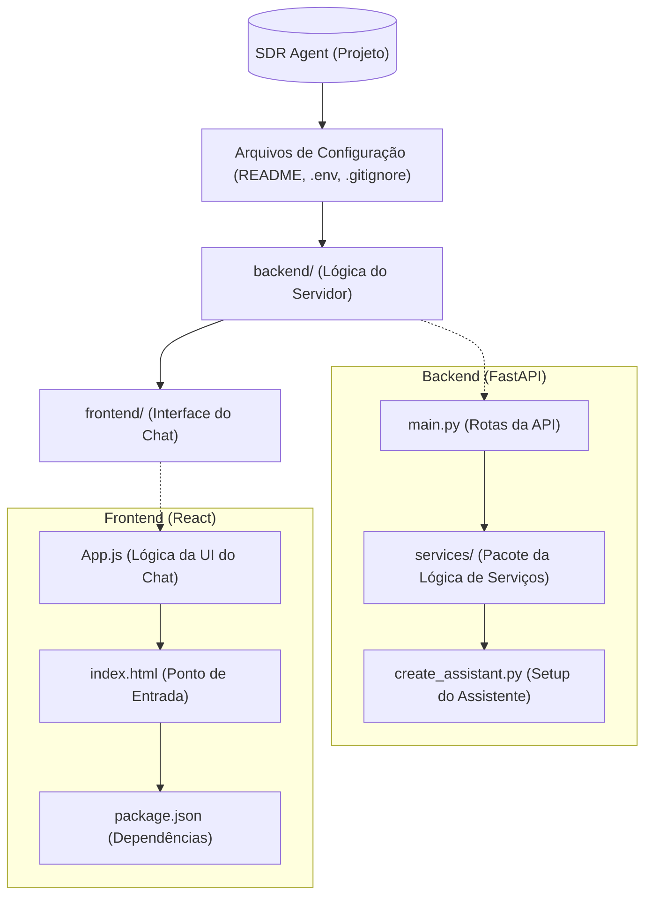
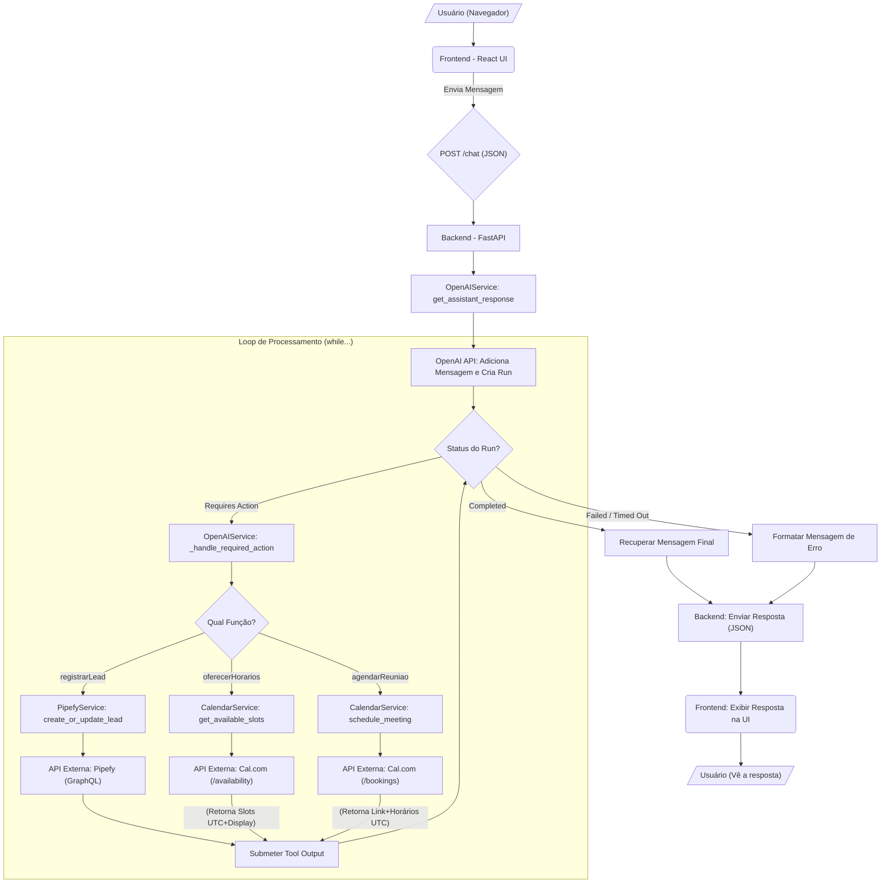

<p align="center">


</p>

<p align="center">
  
</p>

# Desafio Elite Dev IA - SDR Agent

Este projeto implementa um agente SDR (Sales Development Representative) automatizado utilizando a API Assistant da OpenAI, FastAPI para o backend e um webchat baseado em React para o frontend. O agente foi projetado para engajar leads, coletar informações, agendar reuniões (via Cal.com) e gerenciar dados de leads no Pipefy.

## Estrutura Detalhada do Projeto

O projeto é dividido em duas partes principais: `backend` e `frontend`.



### Backend (Python/FastAPI)

Responsável por orquestrar a lógica de negócio, gerenciar sessões e se comunicar com as APIs externas.

  - **`main.py`**: O entrypoint da aplicação FastAPI. Gerencia as rotas da API (como `/chat`, `/session`, `/history`), armazena as sessões ativas (em memória, para desenvolvimento) e associa IDs de sessão a *Threads* da OpenAI. Adiciona `CORSMiddleware` para desenvolvimento local.
  - **`services/`**: Pacote contendo as classes de serviço:
      - **`openai_service.py`**: Gerencia a interação com a OpenAI. Implementa a lógica de *loop* (`while run.status == "requires_action"`) para lidar com múltiplas chamadas de função. Gerencia o mapeamento entre horários de exibição (São Paulo) e horários UTC para o assistente.
      - **`pipefy_service.py`**: Gerencia a comunicação com a API GraphQL do Pipefy. Implementa a lógica de `create_or_update_lead`.
      - **`calendar_service.py`**: Integra-se com a **API v1 do Cal.com** para buscar horários disponíveis (`/availability`) e agendar reuniões (`/bookings`), retornando o link da videoconferência (ex: Google Meet) ou um link de confirmação. Realiza a conversão de horários UTC para strings legíveis em `America/Sao_Paulo`.
  - **`models.py`**: Define os modelos de dados Pydantic usados pela FastAPI.
  - **`create_assistant.py`**: Script de *setup* único para criar/atualizar o Assistente na OpenAI com as instruções (incluindo a lógica de fuso horário) e definições de função corretas. Salva o `OPENAI_ASSISTANT_ID` no `.env`.
  - **`test_cal_booking.py`**: Script para testar diretamente a função de agendamento do `CalendarService`.
  - **`Dockerfile`**: Define como construir a imagem Docker do backend, incluindo a instalação do locale `pt_BR.UTF-8`.
  - **`pyproject.toml` / `poetry.lock`**: Arquivos de gerenciamento de dependências do Poetry.

### Frontend (React)

Uma interface de chat simples (*single-page application*) para interagir com o backend.

  - **`App.js`**: O componente principal do React. Gerencia o estado da conversa (`messages`), input do usuário, `session_id` e auto-scroll. Contém funções helper (`renderContentWithLinks`, `isTimeSlotMessage`, `parseTimeSlots`) para **formatar mensagens**, renderizar **listas de horários** de forma organizada e transformar **URLs** (incluindo as formatadas como Markdown ou com duplicações) em **links clicáveis**. Utiliza a `Fetch API` para se comunicar com o backend (diretamente em `http://localhost:8000` para dev local, ou via proxy `/api` quando dockerizado).
  - **`App.css`**: Arquivo de estilização para a janela de chat, incluindo estilos para a lista de horários.
  - **`index.js` / `public/index.html`**: Entrypoint padrão do Create React App.
  - **`Dockerfile`**: Define o build multi-estágio para criar a imagem Docker do frontend (build React + servir com Nginx + patches de segurança).
  - **`nginx.conf`**: Configuração do Nginx para atuar como servidor web e proxy reverso para a API do backend (usado na dockerização).
  - **`package.json` / `package-lock.json`**: Arquivos de gerenciamento de dependências do Node.js.

### Fluxo de informação

Este fluxograma ilustra como a informação transita pelo sistema, desde a mensagem do usuário até a resposta final, incluindo o loop de processamento para chamadas de função e a interação com a API do Cal.com.



## Como Começar

### Pré-requisitos

  - **Docker e Docker Compose** (Recomendado)
  - *Ou (para desenvolvimento local)*:
      - Python 3.9+ e [Poetry](https://python-poetry.org/)
      - Node.js 16+ e `npm`
      - Locale `pt_BR.UTF-8` instalado no sistema (para formatação de datas)

### Configuração

1.  **Clone o repositório:**

    ```bash
    git clone <seu-link-do-repositorio>
    cd desafio_elite_dev_ia
    ```

2.  **Variáveis de Ambiente (Crítico\!)**
    Crie um arquivo `.env` na raiz do projeto.

    ```dotenv
    # --- Configuração da OpenAI ---
    OPENAI_API_KEY=sk-proj-XXXXXXXXXXXXXXXX
    # OPENAI_ASSISTANT_ID=XXXXXXXXXXXXXXXXX (Será preenchido pelo script)

    # --- Configuração do Pipefy ---
    PIPEFY_API_KEY=XXXXXXXXXXXXXXXXXXXXXXXX
    PIPEFY_PIPE_ID=XXXXXXXXXXX
    # Nome do campo de e-mail (como na UI do Pipefy)
    PIPEFY_EMAIL_FIELD_NAME="E-mail"
    # IDs dos campos
    PIPEFY_NAME_FIELD_ID="nome_do_lead"
    PIPEFY_EMAIL_FIELD_ID="e_mail"
    PIPEFY_COMPANY_FIELD_ID="empresa"
    PIPEFY_NEED_FIELD_ID="necessidade_espec_fica"
    PIPEFY_INTEREST_FIELD_ID="checklist_vertical"
    PIPEFY_MEETING_LINK_FIELD_ID="link_da_reuni_o"
    PIPEFY_MEETING_TIME_FIELD_ID="data_e_hora_da_reuni_o"

    # --- Configuração do Cal.com ---
    CAL_COM_API_KEY=XXXXXXXXXXXXXXXXXXXXXXXXXXXXXXXX
    CAL_COM_EVENT_TYPE_ID=XXXXXXX # ID numérico do seu Event Type
    CAL_COM_EVENT_DURATION_MINUTES=30 # Duração em minutos do evento
    CAL_COM_USERNAME=XXXXXXXXXXX # Seu username no Cal.com
    # CAL_COM_USER_ID=XXXXXXXX # ID numérico do seu usuário (opcional, removido da lógica atual)
    ```

3.  **Criar/Atualizar o Assistente OpenAI:**
    Execute este script **uma vez** (ou sempre que alterar as instruções/ferramentas).

    ```bash
    cd backend
    poetry install # Instala dependências do backend se ainda não o fez
    poetry run python create_assistant.py
    cd ..
    ```

    Isso criará/atualizará o assistente e adicionará/atualizará o `OPENAI_ASSISTANT_ID` no seu arquivo `.env`.

4.  **Rodando com Docker (Recomendado):**
    Na raiz do projeto:

    ```bash
    docker compose up --build
    ```

    O backend estará em `http://localhost:8000` (API docs em `/docs`) e o frontend em `http://localhost:3000`.

## Arquitetura de Dockerização

A configuração do Docker usa `docker-compose` para orquestrar os serviços de `backend` e `frontend`, simulando um ambiente de produção com um **proxy reverso** (Nginx).

1.  **`docker-compose.yml`**: Define os serviços `backend` (FastAPI) e `frontend` (React+Nginx), passa as variáveis do `.env` e mapeia as portas (`8000` para backend, `3000` para frontend).
2.  **`backend/Dockerfile`**: Constrói a imagem Python, instala dependências (via Poetry), configura o locale `pt_BR.UTF-8` e inicia o `uvicorn`.
3.  **`frontend/Dockerfile`**: Build multi-estágio: instala dependências Node, compila o React (`npm run build`), depois copia os arquivos estáticos para uma imagem Nginx e aplica patches de segurança (`apk upgrade`).
4.  **`frontend/nginx.conf`**: Configura o Nginx para servir os arquivos React (`location /`) e redirecionar chamadas `/api/` para o serviço `backend` na rede Docker (`location /api/`).

### Fluxo de um Pedido de Chat (Dockerizado)

1.  Usuário acessa `http://localhost:3000`.

2.  Nginx (contêiner `frontend`) serve o app React.

3.  Usuário envia mensagem.

4.  React faz `fetch('/api/chat', ...)`.

5.  Navegador envia para `http://localhost:3000/api/chat`.

6.  Nginx intercepta, remove `/api/`, encaminha para `http://backend:8000/chat`.

7.  Backend (FastAPI) processa, chama OpenAI/[Cal.com/Pipefy](https://www.google.com/search?q=https://Cal.com/Pipefy), retorna JSON.

8.  Nginx repassa a resposta ao navegador.

9.  React atualiza o chat.

10. **Rodando Localmente (Alternativa):**
    *Terminal 1: Backend*

    ```bash
    cd backend
    poetry install
    poetry run uvicorn main:app --host 0.0.0.0 --port 8000 --reload
    ```

    *Terminal 2: Frontend*

    ```bash
    cd frontend
    npm install
    npm start
    ```

    O frontend estará em `http://localhost:3000`. **Certifique-se que o `App.js` está usando `fetch('http://localhost:8000/chat', ...)` e que o CORS está habilitado no `backend/main.py` para este modo.**

## Endpoints da API (Backend)

  - **GET /health**: Verificação de saúde.
  - **POST /chat**: Envia mensagem e obtém resposta.
  - **POST /session**: Cria nova sessão.
  - **GET /sessions**: Lista sessões ativas (em memória).
  - **GET /history/{session\_id}**: Obtém histórico.
  - **DELETE /session/{session\_id}**: Deleta sessão e thread OpenAI.

## Como Usar

1.  **Inicie os serviços** (Docker ou Localmente).

2.  **Abra o webchat** (`http://localhost:3000`).

3.  **Interaja com o agente.** Siga o fluxo natural da conversa. O agente irá:

      * Apresentar-se.
      * Coletar Nome, Email, Empresa e Necessidade.
      * Confirmar o interesse em agendar uma reunião.
      * Buscar e apresentar horários disponíveis (já convertidos para o fuso horário de São Paulo).
      * Aguardar sua escolha de horário.
      * Confirmar o agendamento, fornecendo o link da reunião (Google Meet ou link de confirmação do Cal.com).
      * Salvar/atualizar o lead no Pipefy com todos os dados coletados, incluindo os detalhes da reunião.

    **Cenário Típico de Agendamento:**

      * **Você:** `Olá`
      * **Agente:** (Apresentação)
      * **Você:** `Gostaria de informações.`
      * **Agente:** (Pergunta o Nome)
      * **Você:** `Meu nome é Maria.`
      * **Agente:** (Pergunta o Email)
      * **Você:** `maria@exemplo.com`
      * **Agente:** (Pergunta a Empresa)
      * **Você:** `Exemplo Corp.`
      * **Agente:** (Pergunta a Necessidade)
      * **Você:** `Preciso melhorar minhas vendas.`
      * **Agente:** (Confirma interesse em agendar)
      * **Você:** `Sim`
      * **Agente:** (Apresenta a lista de horários formatados, ex: "1. 29 de Outubro às 10:00...")
      * **Você:** `Pode ser 29 de Outubro às 10:00`
      * **Agente:** (Confirma o agendamento com link e hora formatada)

    **Cenário de Recusa:**

      * ... (Após coletar os dados) ...
      * **Agente:** `Gostaria de agendar...?`
      * **Você:** `Não, obrigado.`
      * **Agente:** (Agradece e encerra. O lead já foi salvo no Pipefy).

4.  **Verifique Cal.com e Pipefy:** Após um agendamento bem-sucedido, verifique se a reunião aparece no seu calendário Cal.com (e no Google Calendar vinculado) no horário correto (convertido para seu fuso). Verifique também se o card correspondente no Pipefy foi criado ou atualizado com o link e a data/hora (em UTC) da reunião.

## Funcionalidades Principais

  - **Coleta Automática de Informações**: Nome, email, empresa, necessidades.
  - **Integração com Pipefy**: Criação/atualização de cards via API GraphQL.
  - **Agendamento de Reuniões**: Integração com **Cal.com API v1** para buscar horários e agendar, obtendo link real de videoconferência.
  - **Manutenção de Contexto**: Utiliza Threads da OpenAI.
  - **Interface Web Amigável**: Chat React com auto-scroll, formatação de horários em lista e renderização de links clicáveis.
  - **Tratamento de Fuso Horário**: Lógica centralizada no backend Python para apresentar horários em `America/Sao_Paulo` ao usuário, enquanto usa UTC para APIs.

## Tecnologias Utilizadas

  - **Backend**: FastAPI, Python, OpenAI Assistant API, Poetry, python-dateutil, httpx
  - **Frontend**: React (Hooks), Fetch API, CSS
  - **Integrações**: Pipefy API (GraphQL), **Cal.com API v1**
  - **Infraestrutura**: Docker, Docker Compose, Nginx

## Próximos Passos

  - [ ] Implementar armazenamento persistente para sessões (ex: Redis/Vercel KV) em vez de memória (necessário para deploy serverless).
  - [ ] Adicionar testes unitários/integração.
  - [ ] Implementar autenticação de usuários (se necessário).
  - [ ] Adicionar mais integrações de calendário (Outlook, etc.).
  - [ ] Implementar relatórios analíticos de conversão.
  - [ ] Adicionar suporte a múltiplos idiomas (exigiria mais locales no Docker e instruções ao assistente).
  - [ ] Implementar sistema de follow-up automático por e-mail.