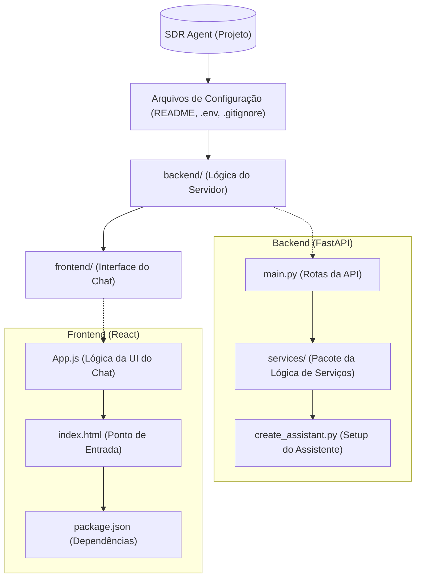
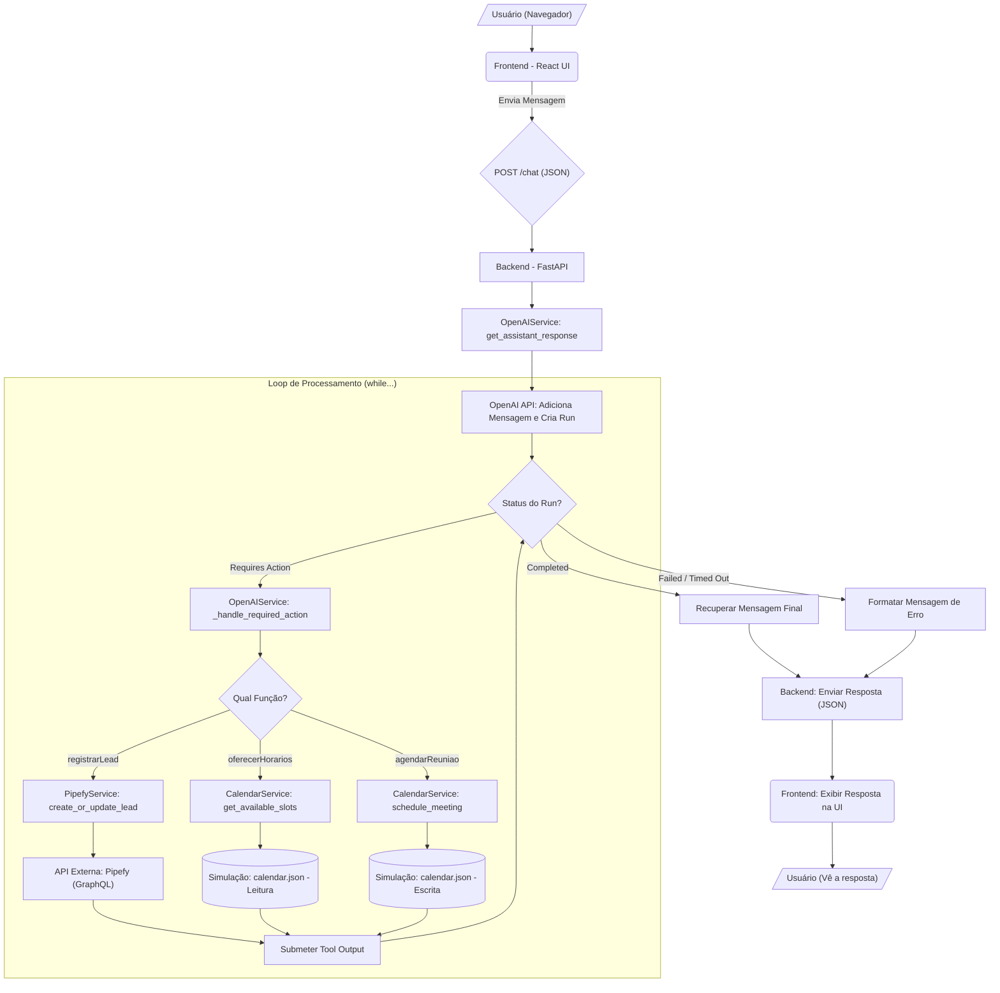

<p align="center">


</p>

<p align="center">
  
</p>


# Desafio Elite Dev IA - SDR Agent

Este projeto implementa um agente SDR (Sales Development Representative) automatizado utilizando a API Assistant da OpenAI, FastAPI para o backend e um webchat baseado em React para o frontend. O agente foi projetado para engajar leads, coletar informações, agendar reuniões e gerenciar dados de leads no Pipefy.

## Estrutura Detalhada do Projeto

O projeto é dividido em duas partes principais: `backend` e `frontend`.



### Backend (Python/FastAPI)

Responsável por orquestrar a lógica de negócio, gerenciar sessões e se comunicar com as APIs externas.

  - **`main.py`**: O entrypoint da aplicação FastAPI. Gerencia as rotas da API (como `/chat`, `/session`, `/history`), armazena as sessões ativas e associa IDs de sessão a *Threads* da OpenAI.
  - **`services/`**: Pacote contendo as classes de serviço:
      - **`openai_service.py`**: Gerencia a interação com a OpenAI. Implementa a lógica de *loop* (`while run.status == "requires_action"`) para lidar com múltiplas chamadas de função sequenciais.
      - **`pipefy_service.py`**: Gerencia a comunicação com a API GraphQL do Pipefy. Implementa a lógica de `create_or_update_lead`.
      - **`calendar_service.py`**: Uma **simulação** de uma API de agenda. Usa um arquivo `calendar.json` local.
  - **`models.py`**: Define os modelos de dados Pydantic usados pela FastAPI para validação de requisições e respostas (ex: `Lead`, `ChatRequest`, `ChatResponse`).
  - **`create_assistant.py`**: Um script de *setup* único. Deve ser executado uma vez para criar o Assistente na plataforma da OpenAI com as instruções e definições de função corretas. Ele salva o `OPENAI_ASSISTANT_ID` gerado no arquivo `.env`.
  - **`calendar.json`**: Arquivo JSON usado como um "banco de dados" fake para a `CalendarService`.

### Frontend (React)

Uma interface de chat simples (*single-page application*) para interagir com o backend.

  - **`App.js`**: O componente principal do React. Gerencia o estado da conversa (`messages`), o input do usuário e a `session_id`. Utiliza a `Fetch API` para se comunicar com o backend (através do proxy `/api`).
  - **`App.css`**: Arquivo de estilização para a janela de chat.
  - **`index.js` / `index.html`**: Entrypoint padrão do Create React App.

### Fluxo de informação

Este fluxograma ilustra como a informação transita pelo sistema, desde a mensagem do usuário até a resposta final, incluindo o loop de processamento para chamadas de função.



## Como Começar

### Pré-requisitos

  - **Docker e Docker Compose** (Recomendado)
  - *Ou (para desenvolvimento local)*:
      - Python 3.9+ e `pip`
      - Node.js 16+ e `npm`

### Configuração

1.  **Clone o repositório:**

    ```bash
    git clone <seu-link-do-repositorio>
    cd desafio_elite_dev_ia
    ```

2.  **Variáveis de Ambiente (Crítico\!)**

    Crie um arquivo `.env` na raiz do projeto. Este arquivo é essencial para o `backend` e o `frontend` (via Docker Compose) funcionarem.

    ```dotenv
    # --- Chave da OpenAI ---
    OPENAI_API_KEY=sk-xxxxxxxxxxxxxxxxxxxxxxxx

    # Esta linha será preenchida automaticamente pelo script create_assistant.py
    # OPENAI_ASSISTANT_ID=asst_xxxxxxxxxxxxxxxx

    # --- Configuração do Pipefy ---
    PIPEFY_API_KEY=eyJ0eXAiOiJKV1QiLCJhbGciOiJIUzUxMiJ9.xxxxxxxx
    PIPEFY_PIPE_ID=123456789

    # --- IDs dos Campos do Pipefy ---
    # É OBRIGATÓRIO preencher estes IDs para a integração funcionar.
    # Você pode encontrar o ID de cada campo na URL do Pipefy ou via API.

    # O NOME do campo de e-mail (exatamente como aparece na UI do Pipefy)
    PIPEFY_EMAIL_FIELD_NAME="E-mail"

    # Os IDs dos campos
    PIPEFY_NAME_FIELD_ID="nome_do_lead"
    PIPEFY_EMAIL_FIELD_ID="e_mail"
    PIPEFY_COMPANY_FIELD_ID="empresa"
    PIPEFY_NEED_FIELD_ID="necessidade_espec_fica"
    PIPEFY_INTEREST_FIELD_ID="checklist_vertical"
    PIPEFY_MEETING_LINK_FIELD_ID="link_da_reuni_o"
    PIPEFY_MEETING_TIME_FIELD_ID="data_e_hora_da_reuni_o"
    ```

3.  **Criar o Assistente OpenAI:**

    Antes de iniciar o servidor, você precisa criar o assistente na OpenAI. O Docker Compose pode fazer isso, mas é recomendado executar manually na primeira vez para garantir:

    ```bash
    # (Opcional, se não for usar Docker) Crie um venv
    # python -m venv venv
    # source venv/bin/activate (ou .\venv\Scripts\activate no Windows)

    pip install -r backend/requirements.txt
    python backend/create_assistant.py
    ```

    Isso criará o assistente e adicionará o `OPENAI_ASSISTANT_ID` ao seu arquivo `.env`.

4.  **Rodando com Docker (Recomendado):**

    Na raiz do projeto, execute:

    ```bash
    docker compose up --build
    ```

    O backend estará acessível em `http://localhost:8000` e o frontend em `http://localhost:3000`.

## Arquitetura de Dockerização

A configuração do Docker neste projeto é projetada para simular um ambiente de produção real usando `docker-compose` para orquestrar múltiplos serviços. A arquitetura consiste em um **proxy reverso** (Nginx) que serve o frontend e encaminha as chamadas de API para o backend.

Aqui está o papel de cada arquivo:

1.  **`docker-compose.yml` (O Orquestrador)**

      * Define e conecta os dois serviços principais: `backend` e `frontend`.
      * `backend`: Constrói a imagem do `backend/Dockerfile` e expõe a porta `8000`. Ele também lê o arquivo `.env` da raiz para obter as chaves de API.
      * `frontend`: Constrói a imagem do `frontend/Dockerfile` e mapeia a porta `3000` do seu computador para a porta `80` do Nginx dentro do contêiner.

2.  **`backend/Dockerfile` (Servidor da API)**

      * Usa uma imagem oficial do Python.
      * Instala as dependências do `requirements.txt`.
      * Copia o código-fonte do backend.
      * Inicia o servidor `uvicorn` na porta `8000`, escutando em `0.0.0.0` (essencial para ser acessível por outros contêineres).

3.  **`frontend/Dockerfile` (Servidor Web + Proxy)**

      * Este é um **build multi-estágio** para otimização:
      * **Estágio 1 (`build`):** Usa uma imagem `node` para instalar as dependências (`npm install`) e "compilar" o aplicativo React (`npm run build`). O resultado é uma pasta `build/` com arquivos estáticos (HTML, CSS, JS).
      * **Estágio 2 (`serve`):** Usa uma imagem leve do `nginx`. Os arquivos estáticos da pasta `build/` (do estágio 1) são copiados para o Nginx.
      * **Segurança:** O comando `RUN apk update && apk upgrade` é incluído para corrigir vulnerabilidades de segurança conhecidas na imagem base do Nginx.

4.  **`frontend/nginx.conf` (O Proxy Reverso)**

      * Este é o cérebro da comunicação frontend-backend.
      * `location /`: Diz ao Nginx para servir os arquivos estáticos do React (o `index.html` e seus assets).
      * `location /api/`: Diz ao Nginx para interceptar qualquer requisição que comece com `/api/` (ex: `/api/chat`), remover o prefixo `/api/` e encaminhar a requisição para o serviço `backend` (resolvido pelo Docker como `http://backend:8000/chat`).

### Fluxo de um Pedido de Chat (Dockerizado)

1.  O usuário acessa `http://localhost:3000` no navegador.

2.  O Nginx (no contêiner `frontend`) entrega o aplicativo React (HTML, CSS, JS).

3.  O usuário envia uma mensagem ("Olá").

4.  O código React (`App.js`) executa `fetch('/api/chat', ...)`.

5.  O navegador envia essa requisição para `http://localhost:3000/api/chat`.

6.  O Nginx intercepta a requisição. A `location /api/` é ativada.

7.  O Nginx encaminha a requisição para `http://backend:8000/chat` (usando a rede interna do Docker).

8.  O `backend` (FastAPI) processa, fala com a OpenAI e retorna uma resposta JSON para o Nginx.

9.  O Nginx retorna essa resposta para o navegador.

10. O React atualiza a interface do chat com a resposta do agente.

11. **Rodando Localmente (Alternativa):**

    Você precisará de dois terminais.

    *Terminal 1: Backend*

    ```bash
    cd backend
    pip install -r requirements.txt
    uvicorn main:app --host 0.0.0.0 --port 8000 --reload
    ```

    *Terminal 2: Frontend*

    ```bash
    cd frontend
    npm install
    npm start
    ```

    O frontend estará em `http://localhost:3000`.

## Endpoints da API (Backend)

  - **GET /health**: Verificação de saúde da API e serviços.
  - **POST /chat**: Envia uma mensagem para o agente SDR.
      - Corpo: `{"session_id": "string", "message": "string"}`
      - Resposta: `{"response": "string", "session_id": "string", "thread_id": "string"}`
  - **POST /session**: Cria uma nova sessão de chat (novo thread).
      - Resposta: `{"session_id": "string", "thread_id": "string", ...}`
  - **GET /sessions**: Lista todas as sessões ativas na memória.
  - **GET /history/{session\_id}**: Obtém o histórico de mensagens formatado de um thread.
  - **DELETE /session/{session\_id}**: Remove uma sessão da memória e deleta o thread na OpenAI.

## Como Usar

1.  **Inicie o backend e frontend** (via Docker ou Localmente).

2.  **Abra o webchat** em `http://localhost:3000`.

3.  **Interaja com o agente SDR.** O chat rolará automaticamente para as novas mensagens.

    **Cenário 1: Agendamento Completo (Teste do Fluxo)**

      * **Você:** `Olá, gostaria de saber mais sobre o produto de vocês.`
      * **Agente:** (Pergunta seu nome)
      * **Você:** `Meu nome é Oseias.`
      * **Agente:** (Pergunta seu email)
      * **Você:** `oseias@tech.com`
      * **Agente:** (Pergunta sua empresa)
      * **Você:** `TechInfo`
      * **Agente:** (Pergunta sua necessidade)
      * **Você:** `Preciso de uma solução para automatizar meu processo de vendas.`
      * **Agente:** (Neste momento, ele chama `registrarLead` pela 1ª vez)
      * **Agente:** `Entendi. Você gostaria de agendar uma reunião com um de nossos especialistas?`
      * **Você:** `Sim, gostaria.`
      * **Agente:** (Chama `oferecerHorarios` e lista os horários)
      * **Você:** `Pode ser na segunda-feira às 10h.`
      * **Agente:** (Chama `agendarReuniao`, que retorna sucesso e o link)
      * **Agente:** (Neste momento, ele chama `registrarLead` pela 2ª vez, agora com o link e a data da reunião)
      * **Agente:** `Perfeito! Agendado. Você receberá o link da reunião no seu e-mail.`

    **Cenário 2: Recusa de Reunião**

      * ... (Coleta de dados) ...
      * **Agente:** `Você gostaria de agendar uma reunião com um de nossos especialistas?`
      * **Você:** `Não, obrigado. Só estou pesquisando.`
      * **Agente:** (Encerra a conversa educadamente. O lead já foi registrado no Pipefy no passo anterior).

4.  **Verifique o Pipefy:**

    Após cada conversa, um novo card deve ser criado ou atualizado no seu funil do Pipefy com as informações do lead. Se o agendamento foi feito, os campos de link e data da reunião também estarão preenchidos.

## Funcionalidades Principais

  - **Coleta Automática de Informações**: O agente coleta nome, email, empresa e necessidades.
  - **Integração com Pipefy**: Criação e **atualização** automática de cards, evitando duplicatas por e-mail.
  - **Agendamento de Reuniões**: Integração com uma simulação de calendário (`calendar.json`).
  - **Manutenção de Contexto**: Utiliza Threads da OpenAI para manter o contexto completo.
  - **Interface Web Amigável**: Chat intuitivo com rolagem automática para novas mensagens.

## Tecnologias Utilizadas

  - **Backend**: FastAPI, Python, OpenAI Assistant API
  - **Frontend**: React (Hooks), Fetch API
  - **Integrações**: Pipefy API (GraphQL), Simulação de Agenda (`calendar.json`)
  - **Infraestrutura**: Docker, Docker Compose

## Próximos Passos

  - [ ] Substituir `calendar.json` por uma API real (Google Calendar, Cal.com, etc.).
  - [ ] Implementar autenticação de usuários (se necessário).
  - [ ] Adicionar mais integrações de calendário (Outlook, etc.).
  - [ ] Implementar relatórios analíticos de conversão.
  - [ ] Adicionar suporte a múltiplos idiomas.
  - [ ] Implementar sistema de follow-up automático por e-mail.