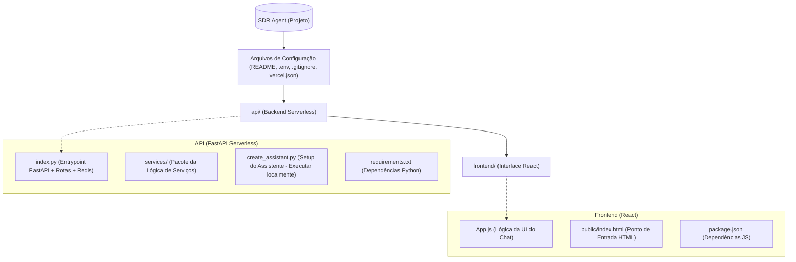
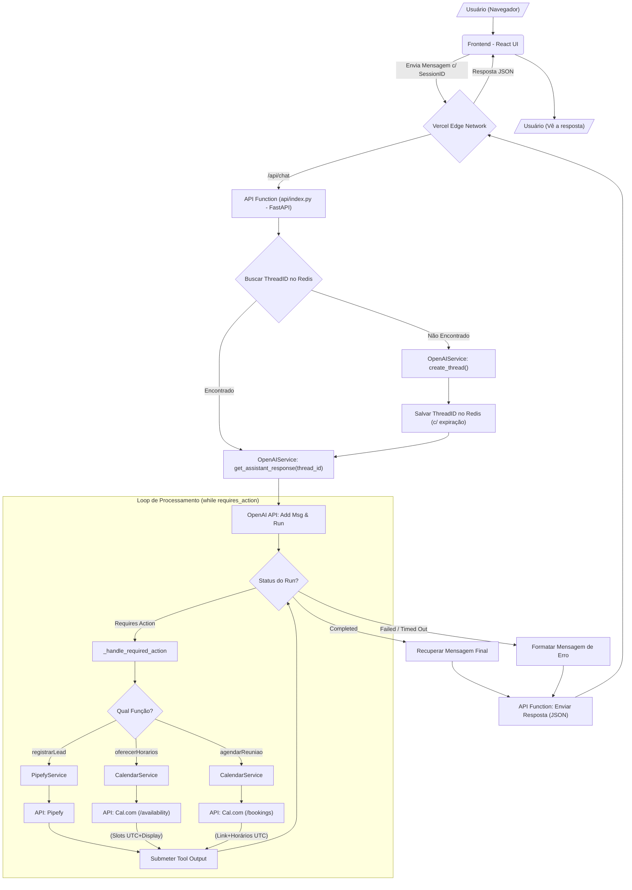
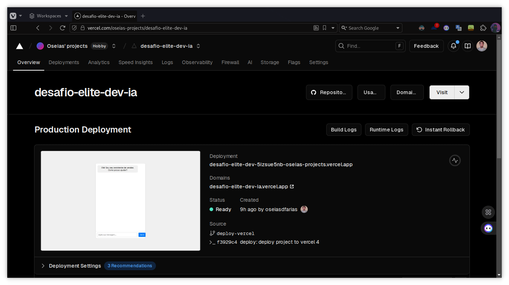
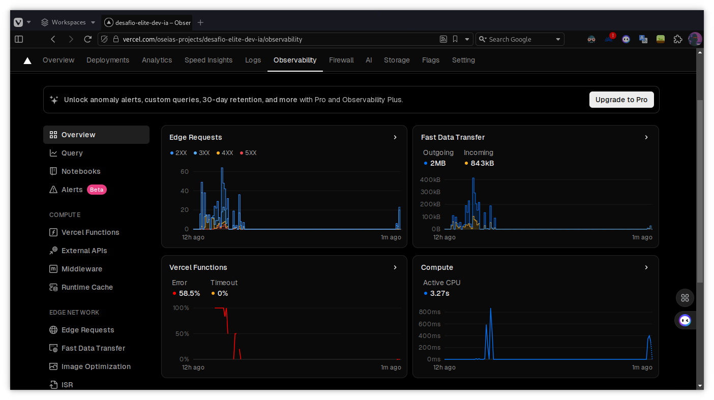
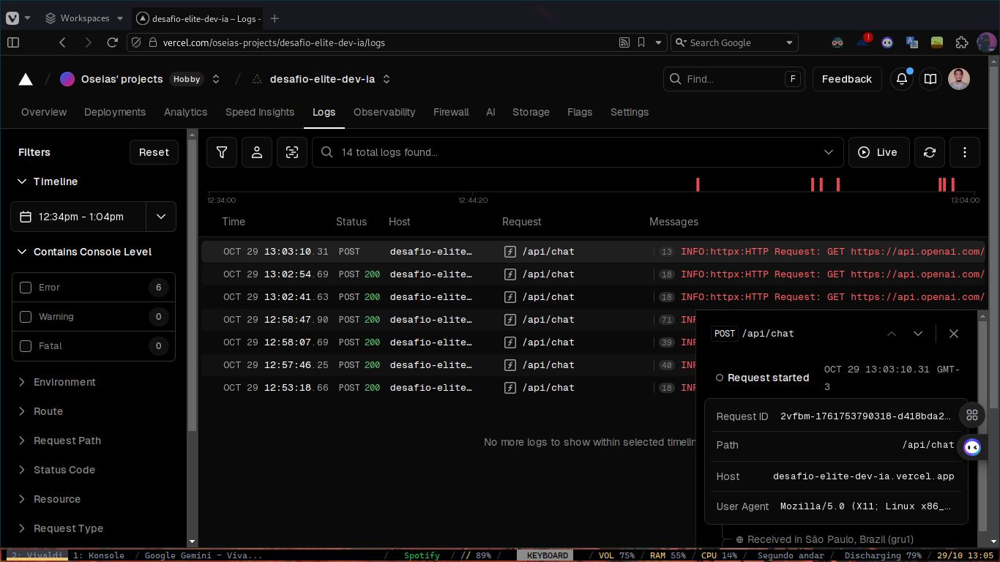
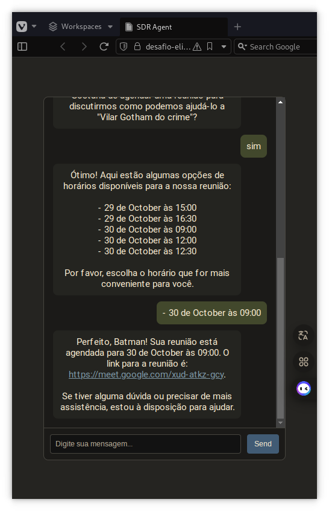

<p align="center">


</p>

<p align="center">
  
</p>


# Desafio Elite Dev IA - SDR Agent

Este projeto implementa um agente SDR (Sales Development Representative) automatizado utilizando a API Assistant da OpenAI, FastAPI (como função serverless na Vercel) para o backend, Redis (Upstash) para gerenciamento de sessão, e um webchat baseado em React para o frontend. O agente foi projetado para engajar leads, coletar informações, agendar reuniões (via Cal.com) e gerenciar dados de leads no Pipefy.

## Estrutura Detalhada do Projeto (Pós-Refatoração para Vercel)

O projeto é estruturado como um monorepo para deploy na Vercel.



### API (Backend Serverless - Python/FastAPI)

Localizada na pasta `api/`, esta parte é implantada como uma Função Serverless Python na Vercel.

  - **`api/index.py`**: O entrypoint FastAPI. Define as rotas (sem o prefixo `/api`). Gerencia a conexão com o **Redis (Upstash)** usando `redis.asyncio` e injeção de dependências (`Depends`) para buscar/salvar `thread_id`s, garantindo a persistência da sessão.
  - **`api/services/`**: Pacote contendo as classes de serviço:
      - **`openai_service.py`**: Orquestra a interação com a OpenAI Assistants API, incluindo o loop de tratamento de ações e o mapeamento de horários UTC/São Paulo.
      - **`pipefy_service.py`**: Interage com a API GraphQL do Pipefy.
      - **`calendar_service.py`**: Interage com a API v1 do **Cal.com** (`/availability`, `/bookings`) e formata horários para `America/Sao_Paulo`.
  - **`api/models.py`**: Define os modelos de dados Pydantic.
  - **`api/create_assistant.py`**: Script para executar **localmente** para criar/atualizar o Assistente OpenAI e salvar o ID no `.env`.
  - **`api/requirements.txt`**: Lista de dependências Python para a Vercel.

### Frontend (React)

Localizado na pasta `frontend/`, implantado como um site estático na Vercel.

  - **`frontend/src/App.js`**: Componente principal React. Gerencia estado do chat, input, `session_id`, auto-scroll. Formata mensagens, renderiza listas de horários e links clicáveis. Faz chamadas `fetch` para **`/api/...`** (roteadas pela Vercel).
  - **`frontend/src/App.css`**: Estilos.
  - **`frontend/public/index.html`**: Template HTML base.
  - **`frontend/package.json` / `package-lock.json`**: Dependências Node.js.

### Fluxo de informação (Com Redis)

O fluxograma ilustra como a informação transita, incluindo a busca/salvamento do `thread_id` no Redis a cada chamada.



## Como Começar

### Pré-requisitos

  - **Conta Vercel** e **Vercel CLI** instalada (`npm install -g vercel`) e logada (`vercel login`).
  - **Conta Upstash Redis** (ou outro Redis acessível publicamente).
  - **Contas/APIs:** OpenAI, Pipefy, Cal.com configuradas.
  - Python 3.10+ e [Poetry](https://python-poetry.org/) (para desenvolvimento backend local e gestão de dependências).
  - Node.js 16+ e `npm` (para desenvolvimento frontend local).
  - Git.

### Configuração e Deploy

1.  **Clone o Repositório.**

    ```bash
    git clone git@github.com:Oseiasdfarias/oseias_desafio_elite_dev_ia.git
    cd desafio_elite_dev_ia
    ```

2.  **Variáveis de Ambiente (`.env` local):**
    Crie um arquivo `.env` na raiz para **desenvolvimento local**.

    ```dotenv
    # --- OpenAI ---
    OPENAI_API_KEY=sk-proj-xxxxxxxxxxxxxxxxxxxxxxxx
    # OPENAI_ASSISTANT_ID=asst_xxxxxxxxxxxxxxxx (Preenchido pelo script)

    # --- Pipefy ---
    PIPEFY_API_KEY=eyJ0eXAiOiJKV1QiLCJhbGciOiJIUzUxMiJ9.xxxxxxxx
    PIPEFY_PIPE_ID=XXXXXXXXXXX
    PIPEFY_EMAIL_FIELD_NAME="E-mail"
    # ... (outros campos Pipefy) ...

    # --- Cal.com ---
    CAL_COM_API_KEY=cal_live_xxxxxxxxxxxxxxxxxxxxxxxxxx
    CAL_COM_EVENT_TYPE_ID=XXXXXXX
    CAL_COM_EVENT_DURATION_MINUTES=30
    CAL_COM_USERNAME=XXXXXXXXXXX

    # --- Redis (Ex: Upstash) ---
    UPSTASH_REDIS_URL="rediss://:SEU_TOKEN@SEU_ENDPOINT.upstash.io:PORTA"
    ```

3.  **Criar/Atualizar o Assistente OpenAI (Localmente):**
    Execute **uma vez** (ou após mudar instruções/ferramentas):

    ```bash
    cd backend # Pasta original com pyproject.toml
    poetry install
    poetry run python ../api/create_assistant.py # Executa o script na pasta api/
    cd ..
    ```

    Isso atualiza o `.env` com o `OPENAI_ASSISTANT_ID`.

4.  **Gerar `requirements.txt` para Vercel:**
    Certifique-se que `api/requirements.txt` reflete as dependências do `pyproject.toml`.

    ```bash
    cd backend
    poetry export -f requirements.txt --output ../api/requirements.txt --without-hashes
    cd ..
    ```

5.  **Rodando Localmente (Opcional):**
    *Terminal 1: Backend*

    ```bash
    # A partir da raiz
    python api/index.py
    ```

    *Terminal 2: Frontend*

    ```bash
    cd frontend
    npm install
    npm start
    ```

    Acesse `http://localhost:3000`. (Verifique URLs no `App.js` e CORS no `api/index.py` para este modo).

6.  **Deploy na Vercel (Recomendado):**
    a.  **Configure o Projeto Vercel:** Crie um projeto na Vercel e conecte ao seu repositório Git.
    b.  **Configure Variáveis de Ambiente e Segredos:** No painel Vercel (`Settings > Environment Variables`), adicione **TODAS** as variáveis do `.env` (`OPENAI_API_KEY`, `PIPEFY_API_KEY`, `UPSTASH_REDIS_URL`, etc.). **Vincule** cada variável (nome MAIÚSCULO) a um **Secret Vercel** (nome minúsculo, ex: `openai_api_key`) onde colará o valor real. Veja `vercel.json` para os nomes `@nome_do_segredo`.
    c.  **Garanta o `vercel.json`:** Verifique se o `vercel.json` (fornecido anteriormente) está na raiz do projeto.
    d.  **Faça o Push para o Git:** Envie todas as alterações para o branch de produção (ex: `main`).
    e.  **Deploy:** A Vercel deve fazer o deploy automaticamente. Ou, rode `vercel --prod` na raiz.

## Arquitetura Vercel (Serverless)

O deploy na Vercel utiliza uma arquitetura serverless:

1.  **`vercel.json`**: Configura o build e o roteamento.
      * `builds`: Instrui a Vercel a construir o frontend React (output em `frontend/build`) e a preparar a API Python (`api/index.py`).
      * `rewrites`: Define as regras de roteamento:
          * Requisições `/api/(.*)` são enviadas para a função `api/index.py`.
          * Outras requisições tentam primeiro servir arquivos estáticos de `frontend/build`.
          * Se nenhum arquivo estático for encontrado, serve `frontend/build/index.html` (fallback para SPA).
      * `env`: Mapeia as Variáveis de Ambiente configuradas no painel Vercel (vinculadas aos Secrets) para a aplicação.
2.  **Frontend**: Servido como arquivos estáticos pela CDN da Vercel.
3.  **Backend**: Executado como Funções Serverless Python (`api/index.py`), acionadas sob demanda pelas requisições `/api/...`.
4.  **Estado da Sessão**: Gerenciado externamente pelo **Redis (Upstash)**, acessado pelo backend a cada requisição via `redis-py`.

## Endpoints da API (Definidos no Backend, Acessados via `/api` na Vercel)

  - **GET /** (`/api/`): Raiz da API.
  - **POST /chat** (`/api/chat`): Envia mensagem e obtém resposta.
  - **POST /session** (`/api/session`): Gera novo `session_id`.
  - **GET /history/{session\_id}** (`/api/history/...`): Obtém histórico.
  - **DELETE /session/{session\_id}** (`/api/session/...`): Deleta sessão (Redis) e thread OpenAI.
  - **POST /session/{session\_id}/reset** (`/api/session/.../reset`): Reseta a sessão.
  - **GET /health** (`/api/health`): Verificação de saúde (inclui Redis).

## Como Usar (Aplicação em Produção - Vercel)

1.  **Acesse a URL** fornecida pela Vercel (ex: `https://seu-projeto.vercel.app`).
2.  **Interaja com o agente.** Siga o fluxo natural:
      * Coleta de dados -\> Registro no Pipefy.
      * Confirmação de interesse -\> Busca de horários no Cal.com.
      * Apresentação dos horários (em Horário de São Paulo).
      * Escolha do horário -\> Agendamento no Cal.com.
      * Confirmação com link (Meet/Zoom ou Cal.com) e hora (São Paulo).
      * Atualização no Pipefy com link e hora (UTC).
3.  **Verifique Cal.com e Pipefy:** Confirme a reunião no [Cal.com/seu](https://www.google.com/search?q=https://Cal.com/seu) calendário e a atualização do card no Pipefy.


## 🚀 Demonstração (Deploy Vercel)

A aplicação foi implantada na Vercel e está acessível publicamente através do link abaixo:

### **Link do Deploy:** *[https://desafio-elite-dev-ia.vercel.app](https://desafio-elite-dev-ia.vercel.app)*

Abaixo estão algumas capturas de tela demonstrando o funcionamento e monitoramento:

**1. Production Deployment (Aplicação Online):**
* *Visão geral da aplicação rodando na URL de produção da Vercel.*
    <p align="center">
      
    </p>

**2. Gráficos de Observabilidade (Vercel):**
* *Painel da Vercel mostrando gráficos de uso, performance ou analytics da aplicação.*
    <p align="center">
      
    </p>

**3. Logs da Função Serverless (Vercel):**
* *Logs da função `api/index.py` no painel da Vercel, exibindo o processamento de requisições.*
    <p align="center">
      
    </p>


**4. Frontend com Diálogos:**
* *Interface do chat em funcionamento, mostrando a interação entre usuário e agente.*
    <p align="center">
      
    </p>

## Funcionalidades Principais

  - **Coleta Automática de Informações**: Nome, email, empresa, necessidades.
  - **Integração com Pipefy**: Criação/atualização de cards via API GraphQL.
  - **Agendamento de Reuniões**: Integração com **Cal.com API v1**.
  - **Manutenção de Contexto**: Utiliza Threads da OpenAI com **persistência de sessão via Redis (Upstash)**.
  - **Interface Web Amigável**: Chat React com auto-scroll, formatação de horários e links.
  - **Tratamento de Fuso Horário**: Lógica no backend Python para apresentar horários em `America/Sao_Paulo`.
  - **Deploy Serverless**: Otimizado para **Vercel**.

## Tecnologias Utilizadas

  - **Backend**: FastAPI (Serverless), Python, OpenAI Assistant API, Poetry (dev), Redis (Upstash), python-dateutil, httpx
  - **Frontend**: React (Hooks), Fetch API, CSS
  - **Integrações**: Pipefy API (GraphQL), **Cal.com API v1**
  - **Infraestrutura**: **Vercel**, **Upstash Redis** (ou outro Redis externo)

## Próximos Passos

  - [ ] Adicionar testes unitários/integração.
  - [ ] Implementar autenticação de usuários (se necessário).
  - [ ] Adicionar mais integrações de calendário (Outlook, etc.).
  - [ ] Implementar relatórios analíticos de conversão.
  - [ ] Adicionar suporte a múltiplos idiomas.
  - [ ] Implementar sistema de follow-up automático por e-mail.